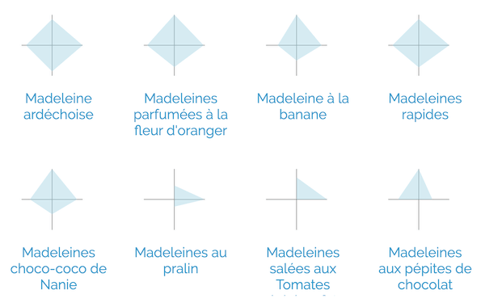

# Madeleine-Radars

Using [radar-chart-d3](https://github.com/alangrafu/radar-chart-d3) to compare the proportions of Flour, Butter, Sugar, and Egg in 147 different recipes of Madeleines (the traditional French sweet sponge cake).

Data: The 147 Madeleine recipes come from [Marmiton.org](http://marmiton.org).

Madeleine-Radars is Open Source at [GitHub](https://github.com/evoluteur/madeleine-radars) with the MIT license.

More Madeleine charts at [Madeleinology](https://evoluteur.github.io/madeleinology/).

Copyright (c) 2024 [Olivier Giulieri](https://evoluteur.github.io/).
